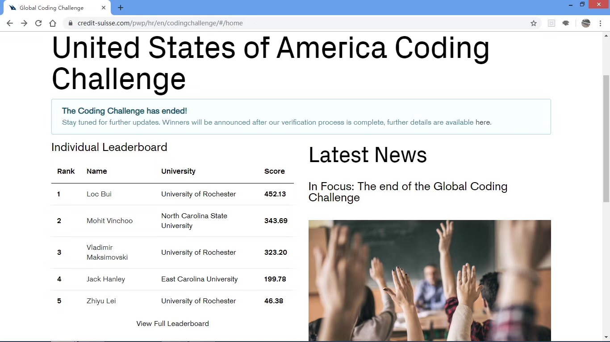
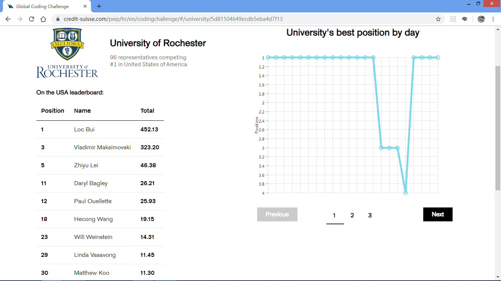

## 2019 Credit Suisse Global Coding Challenge
This project contains the implementations of the functions for the six questions in 2019 Credit Suisse Global Coding Challenge (Oct 2nd - 23rd). The files used for auto-running and checking the codes are not included.

---
### Results:
Fifth place among United States Individual Leaderboard  

---
### Question 1 – Mortgage Repayments
A common question asked by customers at a firm is about payments on mortgages. Customers would like to know what their total estimated cost will be, before signing the contract. A team has spotted this, and would like to develop a new tool that allows users to calculate this value for a firm's new mortgage type, "Simply Buy".

Your task is to develop a method calculateTotalPayment, which takes in three integers – the initial level of debt, the percentage interest, and the percentage repayment, and returns a single integer representing the total cost of the mortgage. Repayment is a fixed percentage of the initial debt, and the interest is a percentage of the current debt.

For the "Simply Buy" mortgage, there is a fixed 10% deposit, which should be included in the total payment, and each month interest is added before a repayment is made.

#### Example
Input: `initialLevelOfDebt = 1000, interestPercentage = 5, repaymentPercentage = 10`

Output: `1520`

---
### Question 2 – Risk and Reward
A team of traders have a series of trades, numbered 0-_i_, that they can fulfill for a client.
+ We have three arrays: `trader`, `risk`, and `bonus`.
+ `trader[i]` gives the skill level of the _i_ th trader.
+ `risk[i]` gives the difficulty of the _i_ th trade. Only traders with a skill level at or above `risk[i]` can complete `trade[i]`. Completion of a `trade[i]` gives the team a bonus of `bonus[i]`.

What is the biggest bonus the traders can make?

#### Constraints
+ `trader.length`, `risk.length`, `bonus.length` >= 1 and <= 10,000.
+ The arrays are not necessarily in ascending order (although `bonus[i]` and `risk[i]` will always correspond to the bonus and risk of trade _i_).
+ Each trader is only able to take on at most one trade, but multiple traders can complete the same trade.

#### Output Format
The value returned should be the maximum profit that can be made from your trading strategy.

#### Example 1
Input: `trader = [6, 7, 2, 8, 1], risk = [5, 4, 3, 1, 8], bonus = [9, 9, 1, 9, 4]`

Output: 45

#### Example 2
Input: `trader = [2, 10, 9, 10, 10], risk = [9, 1, 1, 6, 1], bonus = [9, 9, 8, 10, 10]`

Output: 50

---
### Question 3 – Where did I finish?
You are a participant in a hacking competition at Credit Suisse and want to track the progress of your rankings as you progress up the leaderboard. The leaderboard for the purpose of this challenge (not the actual scoring used) is to use Dense Ranking, which works like this:
+ The participant with the highest score is ranked number 1 on the leaderboard.
+ Participants who have equal scores receive the same ranking number, and the next participants(s) receive the immediately following ranking number.

For your set of scores, you must calculate your modal rank. If there are multiple modes, return the highest value.

#### Input Format
The first input is an array of _n_ scores of all the participants, `scores`.

The second input is an array of your _m_ scores `yours`.

#### Output Format
The return value should be your modal ranking.

#### Example
Input: `socres = [100, 90, 90, 80, 75, 60], yours = [50, 77, 77, 90]`

Output: 4, because your ranks were `[6, 4, 4, 2]` and 4 is the modal value

---
### Question 4 – Choosing Wisely
Lisa has a maximum total complexity of trades that she is able to fulfill in one day. In the morning, she is given a list of trades to choose from. Each one has a value, `v` and a complexity, `c`. What is the maximum value of trades that she can execute, given her complexity constraint?

#### Input Format
The inputs are a pair of arrays, `v` and `c`, and a maximum complexity, `mc`. The elements of `v` represent trade value in millions of dollars and is any positive integer. The complexity is between 0-100 and represents a percentage. The maximum complexity is a scalar integer.

#### Output Format
The value returned should be the maximum value of trades that Lisa can execute.

#### Example
Input: `v = [6, 10, 12], c = [30, 60, 90], mc = 150`

Output: 22, because the maximum value elements that Lisa has capacity for is at index 1 and 2, which have complexities 60 + 90 = 150 and values 10 + 12 = 22

---
### Question 5 – Self Preservation
You are a security software engineer at Canary Investments. The project your team is working on involves creating an application to mock the response to a potential high severity security threat and prevent it.

The security threat _x_, will arrive at the company at time _tx_, and in order to maintain the severity of the threat, we assume that data obtained from our company will be sent back to the hackers at frequency _fx_.

In order to defend the data of your organisation, you must counter the security threats posed by the attack with an instance of an application developed by your team, X. The frequency of X can be modified to match the frequency of the threat. Modifying the initial frequency of X, _fx_ to the frequency required to defend from the threat, _fy_, will require |_fy_ - _fx_| units of time. If two threats of the same frequency arrive at the same time, you can counter them with the same instance of X.

Find the minimum number of instances of X which are needed, to protect the safety of your organisation.

#### Input Format
The input is an _n_ Integer array. The first Integer represents the number of security threats posed. This is followed by _n_ pairs of integers _ti_ and _fi_, this pair contains the time frequency of the _i_th threat.

#### Output Format
One integer which shows the minimum number of instances of X you need to run to defend against the security attack.

#### Example 1
Input: `[4, 1, 1, 2, 2, 3, 1, 5, 1]`

The first Integer is 4, therefore there are 4 security threats posed. X is launched at _t_=1 with _f_=1, which successfully counters the threat posed at the pair 1,1. X is then modified to be a frequency of 2 in 1 time unit, and counters the next attempted security breach at _t_=2. Following this it is then again returned to a frequency of 1 and counters at _t_=3, and then counters with the same frequency of 1 at _t_=5.

Thus, 1 instance of application X is enough to successfully counter this series of security threats.

Output: 1

#### Example 2
Input: `[4, 1, 1, 2, 3, 3, 1, 5, 1]`

The first Integer is 4, therefore there are 4 security threats posed. X is launched at _t_=1 with _f_=1, which successfully counters the threat posed at 1,1. At _t_=2, X needs to be a frequency of 3, this takes 2 time units (as mentioned above, modifying the initial frequency of X, _fx_ to the frequency required to defend from the threat, _fy_, will require |_fy_ - _fx_| units of time); therefore, a new instance of X is needed to counter the next attempted security breach at _t_=2. The first instance of X then can remain at a frequency of 1 and counters at _t_=3, and then counters with the same frequency of 1 at _t_=5.

Thus, 2 instances of application X are enough to successfully counter this series of security threats.

Output: 2

---
### Question 6 – Starting and Ending well
You are a developer at Canary Investments, and are currently working on a project which involves handling an highly confidential portfolio of emerging market, real estate and technology stocks _S_. _Si_ has value _i_.

You are given the task of evaluating the portfolio, and finding the stock with maximum value which has the provided starting and ending in order to make further decisions about this portfolio. If such a stock does not exist in your portfolio, then return -1 in order to indicate this.

Your method of evaluating a portfolio must be able to efficiently evaluate portfolios of varying values and stocks.

#### Input Format
The input is an array of stocks _S_, such that _Si_ has value _i_.

#### Output Format
The return value should be an integer _n_, which denotes the index of highest valued stock with the given starting and ending.
